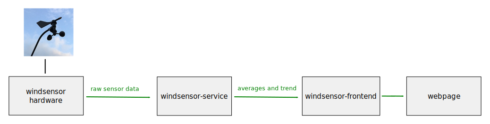
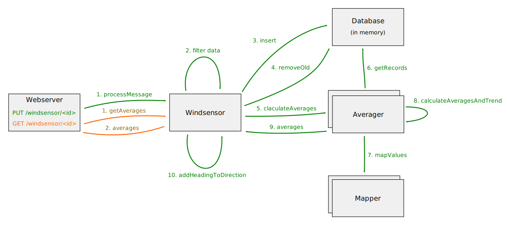

# windsensor-service

This test driven developed service is part of the following design.

It is responsible to consumes the raw sensor values (wind direction and speed) provided by the windsensor hardware (via HTTP PUT requests) and calculates ...

* one minute average
* ten minute average

Both averages contain a trend describing the way the wind speed changed within the averaging period.

## service architecture

The following diagram describes the internal architecture of the service.

## Input message format

The sensor hardware evaluates the wind speed (pulses of the anemometer) and direction (heading of the vane) every second and stored them for later delivery to this service. To send the stored data to the service, a HTTP PUT request to `/windsensor/<id>` gets used. The payload of the request contains a JSON object of the following format (the following examples delivers data of the past 5 seconds):

    {
        version:"1.0.0",
        sequenceId:102,
        anemometerPulses:[0,1,4,2,1],
        directionVaneValues:[32,38,35,38,39]
    } 
    

|property|type|range|description|
|--------|----|-----|-----------|
|version|string|"1.0.0"|The message format version|
|sequenceId|integer|0 <= id <= 999|This property gets used to identify duplicates and out of order received messages. It gets incremented for each new message and wraps around ( ..., 998, 999, 0, 1, ...).|
|anemometerPulses|array of integers|0 <= pulses <= 255|Each value in the array defines the number of anemometer pulses countered within one second|
|directionVaneValues|array of integers|0 <= direction <= 4095|Each value in the array defines the directionthe vane was pointing to. 0 stands for 0° (north), 1024 for 90° (east), 2048 for 190° (south) and 3072 for 270° (west).|

## Output message format

The calculated average values can be polled by using a HTTP GET request to `/windsensor/<id>`. The response contains a JSON object of the following format:

    {
        version:   '1.0.0',              
        timestamp: '2020-09-21T11:53:40.560Z',
        oneMinute: {
            direction: {
                average: 182.9
            }, 
            speed: {
                average: 23.2,
                minimum: 12.1,
                maximum: 30.9,
                linearTrend: {
                    quotient: 2.4,
                    offset: 13.2
                }
            }, 
        tenMinutes: {
            direction: {
                average: 150.3
            }, 
            speed: {
                average: 25.4,
                minimum: 11.9,
                maximum: 35.9,
                linearTrend: {
                    quotient: 0.3,
                    offset: 25.1
                }
            }
    }

|property|type|range|description|
|--------|----|-----|-----------|
|version|string|"1.0.0"|The message format version|
|timestamp|string||The calculation time (in simplified extended ISO format, ISO 8601)|
|oneMinute|object||The one minute average values|
|tenMinute|object||The ten minute average values|

### Average value format

|property|type|range|unit|description|
|--------|----|-----|----|-----------|
|direction.average|float|0 <= direction < 360|degrees|The average direction.|
|speed.average|float|0 <= average|km/h|The average wind speed.|
|speed.minimum|float|0 <= minimum|km/h|The minimum wind speed.|
|speed.maximum|float|0 <= maxmimum|km/h|The maximum wind speed.|

The linear speed trend is a linear function "f(x) = offset + x * quotient" that describes the tendency of the measured wind speeds in the averaging duration (in km/h). The higher the quotient the stronger the wind speed increased (positive quotient values) or decreased (negative quotient values). A quotient close to zero indicates constant wind speeds.

## building the Docker image

To build the Docker image execute `buildDockerImage.sh`.

## starting the service (using docker)

For a successful execution of the service you need to set the environment variable `SENSOR_ID`. The following command starts the service for the sensor 11223. The HTTP interface is available on port 80.

    sudo docker run -it --rm --env SENSOR_ID=11223 -p 80:80 tederer/windsensor

The table below describes all supported environment variables.

|variable        |mandatory|type   |description|
|----------------|---------|-------|-----------|
|SENSOR_ID       |yes      |integer|The ID of the sensor (range: 1 - 99999)|
|SENSOR_DIRECTION|no       |float  |The direction (in degrees) of the sensor that should be used when the sensor reports 0°.|
|LOG_LEVEL       |no       |string |one of [DEBUG,INFO,WARNING,ERROR,OFF]|

## executing the tests

To execute the tests, run the script `startNodeJsContainer.sh`. It starts a Docker container containing Node.js. The current folder (containing `startNodeJsContainer.sh`) gets mounted into the container. You can run the linter and the tests by calling `runGrunt.sh`.

## references
[windsensor-frontend](https://github.com/tederer/windsensor-frontend)